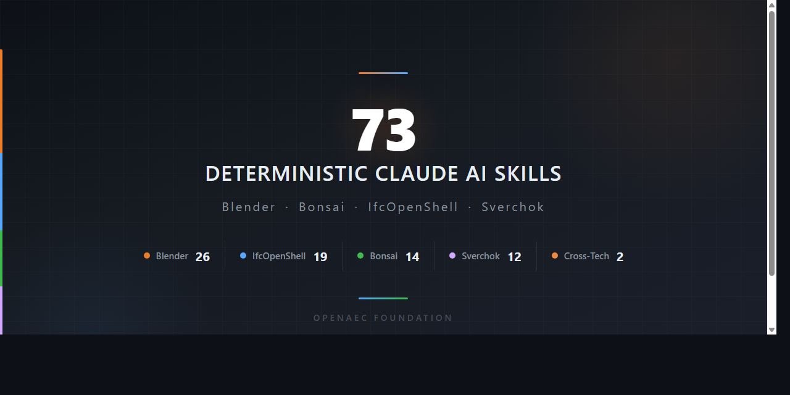

<p align="center">
  
</p>

<p align="center">
  <a href="#installation"></a>
  <a href="#version-compatibility"></a>
  <a href="#version-compatibility"></a>
  <a href="LICENSE"></a>
</p>

<p align="center">
  <strong>73 deterministic skills</strong> enabling Claude AI to generate flawless Blender/BIM/IFC/Sverchok code.<br>
  Built with the <a href="https://github.com/OpenAEC-Foundation/Open-Agents">Open-Agents</a> multi-agent orchestration framework.
</p>

---

## Why This Exists

Claude is powerful, but without domain-specific guidance it generates BIM/IFC code that *looks* correct but **fails in production**.

**The #1 cause of AI-generated IFC failures:**

```python
# WRONG - This creates an orphan entity with no relationships
wall = ifc_file.create_entity("IfcWall")

# CORRECT - API ensures valid ownership, relationships, and GlobalId
wall = ifcopenshell.api.run("root.create_entity", ifc_file,
    ifc_class="IfcWall", name="Wall_001")
```

**This skill package solves it** by giving Claude exact API syntax, decision trees, error diagnostics, and version-aware patterns for every operation.

---

## Skill Packages

| Package | Skills | Syntax | Impl | Errors | Core | Agents |
|---------|:------:|:------:|:----:|:------:|:----:|:------:|
| [Blender](skills/blender/) | **26** | 11 | 6 | 3 | 4 | 2 |
| [IfcOpenShell](skills/ifcopenshell/) | **19** | 4 | 9 | 3 | 2 | 1 |
| [Bonsai](skills/bonsai/) | **14** | 4 | 7 | 1 | 1 | 1 |
| [Sverchok](skills/sverchok/) | **12** | 4 | 5 | 1 | 1 | 1 |
| [Cross-Tech](skills/aec-cross-tech/) | **2** | — | — | — | 1 | 1 |
| **Total** | **73** | **23** | **27** | **8** | **9** | **6** |

Each package is **standalone** — install only the technologies you work with.

See [INDEX.md](INDEX.md) for the full skill catalog with descriptions.

### Skill Categories

| Category | Purpose | Example |
|----------|---------|---------|
| `syntax/` | API syntax, code patterns, method signatures | `blender-syntax-operators` |
| `impl/` | Step-by-step development workflows, decision trees | `bonsai-impl-modeling` |
| `errors/` | Error handling, diagnostics, anti-patterns | `ifcos-errors-schema` |
| `core/` | Cross-cutting: API overview, version matrix, concepts | `blender-core-api` |
| `agents/` | Intelligent orchestration, validation | `aec-agents-workflow-orchestrator` |

---

## Installation

### Claude Code (CLI)

**Option 1 — Copy skills into your project:**
```bash
# Clone the repository
git clone https://github.com/OpenAEC-Foundation/Blender-Bonsai-ifcOpenshell-Sverchok-Claude-Skill-Package.git

# Copy the skills you need into your project
cp -r Blender-Bonsai-ifcOpenshell-Sverchok-Claude-Skill-Package/skills/blender/ your-project/.claude/skills/blender/
cp -r Blender-Bonsai-ifcOpenshell-Sverchok-Claude-Skill-Package/skills/ifcopenshell/ your-project/.claude/skills/ifcopenshell/
```

**Option 2 — Reference in CLAUDE.md:**
```markdown
# In your project's CLAUDE.md, add:
When working with Blender/IFC/Bonsai code, load and follow the skills in:
/path/to/Blender-Bonsai-ifcOpenshell-Sverchok-Claude-Skill-Package/skills/
```

**Option 3 — Install per-package (use only what you need):**
```bash
# Only Blender skills
cp -r skills/blender/ ~/.claude/skills/blender/

# Only IfcOpenShell skills
cp -r skills/ifcopenshell/ ~/.claude/skills/ifcopenshell/

# Only Bonsai skills
cp -r skills/bonsai/ ~/.claude/skills/bonsai/

# Only Sverchok skills
cp -r skills/sverchok/ ~/.claude/skills/sverchok/

# Cross-technology workflows
cp -r skills/aec-cross-tech/ ~/.claude/skills/aec-cross-tech/
```

---

## Version Compatibility

| Technology | Supported Versions |
|------------|--------------------|
| Blender | 3.x, 4.x, 5.x |
| IfcOpenShell | Latest (IFC2X3, IFC4, IFC4X3 schemas) |
| Bonsai | v0.8 (formerly BlenderBIM) |
| Sverchok | Current |

---

## Methodology

Built using the **7-phase research-first methodology** proven in the [ERPNext Skill Package](https://github.com/OpenAEC-Foundation/ERPNext_Anthropic_Claude_Development_Skill_Package):

> **Core principle**: Research first, then build. Never create skills based on assumptions.

Skills were created in parallel via [Open-Agents](https://github.com/OpenAEC-Foundation/Open-Agents) multi-agent orchestration, with each skill validated against official documentation and real-world usage.

| Phase | Description | Status |
|:-----:|-------------|:------:|
| 1 | Raw Masterplan | Complete |
| 2 | Deep Research | Complete |
| 3 | Masterplan Refinement | Complete |
| 4 | Topic-Specific Research | Complete |
| 5 | Skill Creation | Complete |
| 6 | Validation | Complete |
| 7 | Publication | Complete |

---

## Documentation

| Document | Purpose |
|----------|---------|
| [INDEX.md](INDEX.md) | Full skill catalog with descriptions |
| [ROADMAP.md](ROADMAP.md) | Project status (single source of truth) |
| [REQUIREMENTS.md](REQUIREMENTS.md) | What skills must achieve, quality guarantees |
| [DECISIONS.md](DECISIONS.md) | Architectural decisions with rationale |
| [SOURCES.md](SOURCES.md) | Official documentation and reference materials |
| [WAY_OF_WORK.md](WAY_OF_WORK.md) | 7-phase development methodology |
| [LESSONS.md](LESSONS.md) | Lessons learned during development |
| [CHANGELOG.md](CHANGELOG.md) | Version history |
| [CONTRIBUTING.md](CONTRIBUTING.md) | How to contribute |

## Related Projects

| Project | Role |
|---------|------|
| [ERPNext Skill Package](https://github.com/OpenAEC-Foundation/ERPNext_Anthropic_Claude_Development_Skill_Package) | Proven methodology template |
| [Open-Agents](https://github.com/OpenAEC-Foundation/Open-Agents) | Multi-agent orchestration tooling |
| [Impertio AI Ecosystem](https://github.com/OpenAEC-Foundation/Impertio-AI-Ecosystem-Deployment) | General AI workspace lessons |

## License

MIT License — see [LICENSE](LICENSE).

---

*Part of the [OpenAEC Foundation](https://github.com/OpenAEC-Foundation) ecosystem.*
